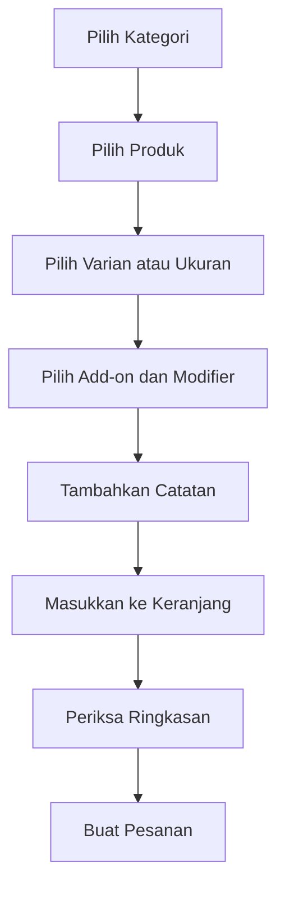

✨ Fitur Utama
Akses menu melalui QR meja.
Identifikasi cabang dan nomor meja secara otomatis.
Menampilkan produk berdasarkan cabang.
Filter produk berdasarkan kategori.
Pilihan varian dan ukuran produk.
Pilihan add-on dan modifier.
Catatan khusus untuk setiap item.
Keranjang dan ringkasan pembayaran.
Perhitungan subtotal, diskon, pajak, dan total.
Pembayaran melalui Midtrans Snap Sandbox.
Simulator pembayaran lokal tanpa akun Midtrans.
Status pembayaran berhasil, pending, atau gagal.
Nota pembelian digital.
Pengiriman pesanan ke Kitchen Display.
Notifikasi pesanan baru pada POS kasir.
Tampilan responsif untuk smartphone dan tablet.

🧰 Teknologi yang Digunakan
Versi berikut merupakan versi yang terkunci pada package-lock.json.
| Teknologi | Versi | Kegunaan |
|---|---:|---|
| React | `19.2.8` | Membangun antarmuka dan komponen aplikasi |
| React DOM | `19.2.8` | Menampilkan komponen React pada browser |
| TypeScript | `7.0.2` | Type safety dan pencegahan kesalahan data |
| Vite | `8.2.0` | Development server dan build aplikasi |
| Vite React Plugin | `6.0.5` | Integrasi React dengan Vite |
| Lucide React | `1.28.0` | Ikon pada antarmuka mobile |
| CSS Responsif | Native CSS | Layout smartphone, tablet, dan desktop |
| Web App Manifest | PWA | Mendukung instalasi aplikasi dari browser |
| Fetch API | Browser API | Komunikasi dengan REST API Laravel |
| Midtrans Snap | Sandbox/Production | Payment gateway |
| Local Payment Simulator | Internal | Pengujian pembayaran tanpa akun Midtrans |

Backend yang Digunakan
Mobile Self Service terhubung dengan backend utama POSphere.
| Teknologi | Versi | Kegunaan |
|---|---:|---|
| PHP | `8.3+` | Runtime backend |
| Laravel | `13.23.0` | REST API dan business logic |
| SQLite | Development | Database lokal |
| MySQL | Production | Database server |
| Midtrans API | Sandbox/Production | Pembayaran dan verifikasi transaksi |

