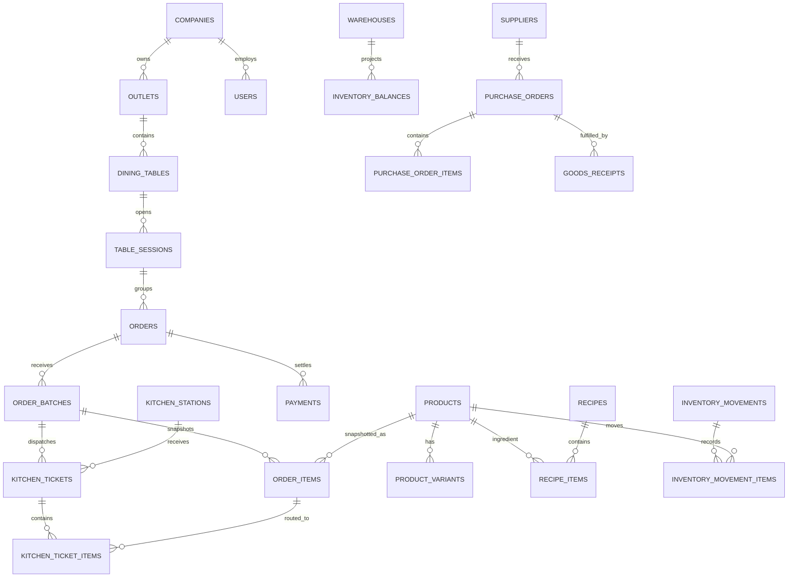

# POS & Inventory F&B - Database Map

Dokumen ini menerjemahkan PRD v2.1 ke kelompok tabel relasional. Implementasi MVP ada pada migrasi `2026_07_30_000001_create_pos_core_schema.php`.

## Relasi inti

## State yang sengaja dipisahkan

- `orders.production_status`: draft, confirmed, sent_to_kitchen, in_progress, ready, served, cancelled, voided.
- `orders.payment_status`: open_bill, payment_pending, partially_paid, paid, refunded.
- `kitchen_tickets.status`: queued, accepted, preparing, ready, served, cancelled.
- `payments.status`: pending, processing, paid, failed, expired, cancelled, partially_refunded, refunded.

Kitchen ticket dibuat dari `order_batches` saat submit, bukan ketika payment menjadi paid. Perubahan pembayaran hanya memperbarui label KDS melalui referensi order yang sama.

## Modul lanjutan yang disiapkan PRD

RBAC (`roles`, `permissions`, `user_roles`), modifier menu, promo/voucher, loyalty ledger, stock opname, waste, transfer, purchase requisition/return, cashier shift, print job, sync outbox, idempotency key, notification, dan audit log dapat ditambahkan per fase roadmap tanpa mengubah relasi inti di atas.
